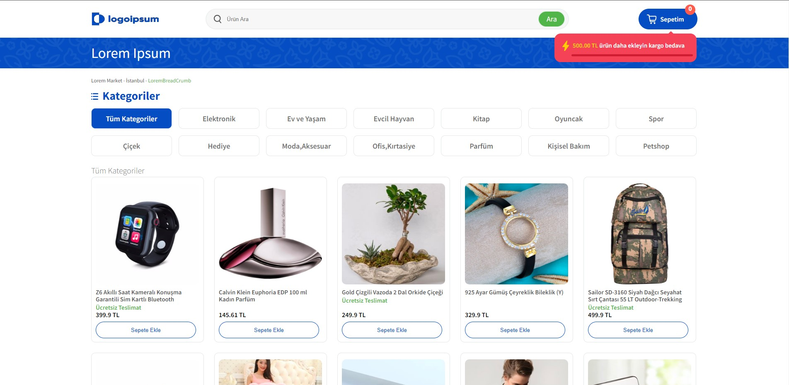
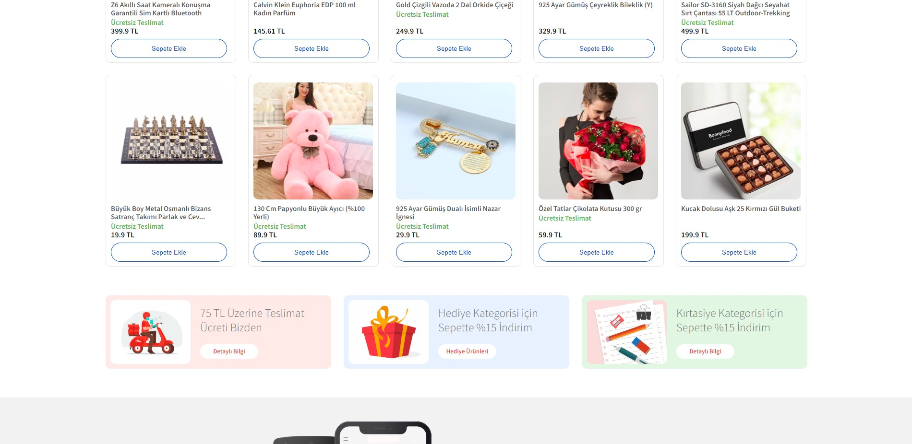
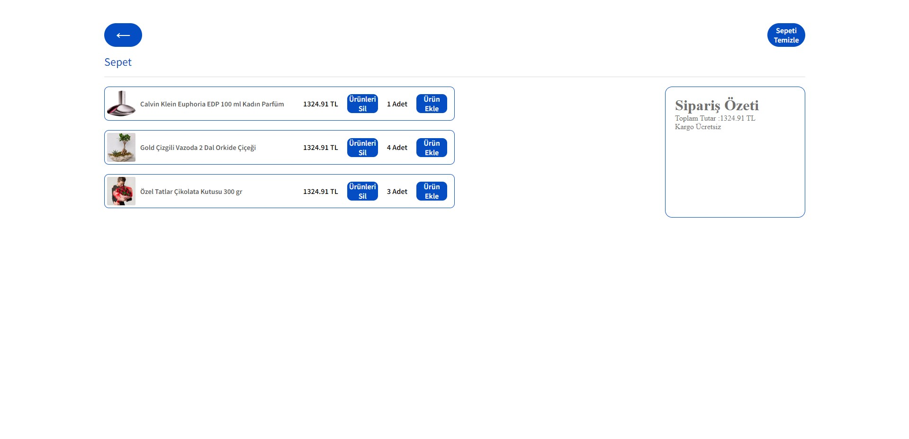

# Start JSON Server
### `npx json-server --watch src/Data/db.json --p 3002`

## Live Demo 
https://eclectic-yeot-11d4fc.netlify.app/
# Getting Started with Create React App

This project was bootstrapped with [Create React App](https://github.com/facebook/create-react-app).

## Available Scripts

In the project directory, you can run:

### `npm start`

Runs the app in the development mode.\
Open [http://localhost:3000](http://localhost:3000) to view it in your browser.

## USED TECHNOLOGIES

 

✔️ React 
✔️ Redux 
✔️ Redux Persist 
✔️ JSON-SERVER 
✔️ React-Router 
✔️ SASS 